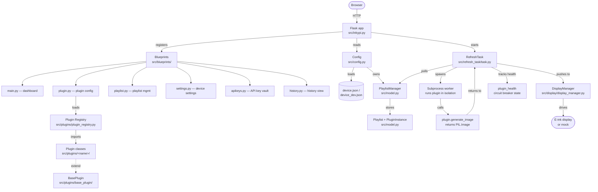

# InkyPi Architecture

A high-level map of how requests flow through the app and how the refresh loop drives the e-ink display.

## Overview

InkyPi is a Flask web app + a background refresh task that runs in the same process. The web UI lets the user configure plugins and assemble them into playlists; the refresh task picks the next plugin from the playlist on a schedule, runs it, and pushes the resulting image to the display.

## Component diagram

## Request flow (web UI)

1. Browser sends an HTTP request to a Flask route registered by one of the blueprints.
2. The blueprint reads/writes `Config` and `PlaylistManager` (both backed by `device.json`).
3. The blueprint may call into a plugin's `generate_settings_template()` to render its config form, but it does **not** run `generate_image()` synchronously — that happens in the refresh task.
4. The response is rendered with Jinja2 templates from `src/templates/`.

## Refresh flow (background)

1. `RefreshTask` runs in a background thread started during app init.
2. On each tick, it asks `PlaylistManager` for the next plugin instance (based on schedule + `paused` state from the circuit breaker).
3. It spawns a **subprocess** to run the plugin in isolation. Subprocess isolation means a crashing plugin can't take down the app.
4. The plugin's `generate_image()` returns a `PIL.Image`. Result is sent back to the parent over a queue.
5. The parent updates `plugin_health` (success/failure counters, circuit-breaker state) and pushes the image to `DisplayManager`.
6. `DisplayManager` chooses the right driver (Inky, Waveshare, mock) and writes to the panel.

## Config layer

- `device.json` (or `device_dev.json` in dev mode) is the single source of truth for device settings, playlists, and saved plugin instances.
- `Config` loads it once at startup and provides locked accessors.
- `PlaylistManager` is a child of `Config` that manages `Playlist` and `PluginInstance` objects.
- All persistent state lives in `device.json` — there is no database.

## Plugin lifecycle

- At startup, `plugin_registry.load_plugins()` walks `src/plugins/`, reads each `plugin-info.json`, imports the class, and instantiates it.
- Each `PluginInstance` is a saved configuration of a plugin (e.g., "Weather — Home" and "Weather — Work" are two instances of the weather plugin).
- The refresh task picks one `PluginInstance` per tick and runs it via a subprocess worker.

## Where to look next

- New to the codebase? Start with `src/inkypi.py` (~200 lines after JTN-289 split) to see the wiring.
- Building a plugin? See [building_plugins.md](building_plugins.md) — there's a hello-world walkthrough at the bottom.
- Understanding the refresh loop? Read `src/refresh_task/task.py` — `_determine_next_plugin` and `_update_plugin_health` are the key methods.
- Display drivers? `src/display/` — `DisplayManager` selects the driver based on `device.json`.
