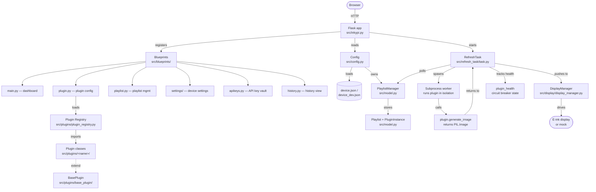

# InkyPi Architecture

A high-level map of how requests flow through the app and how the refresh loop drives the e-ink display.

## Architecture Decision Records

Non-obvious design choices are documented as Architecture Decision Records (ADRs) in [`docs/adr/`](adr/README.md). Each ADR records the context, the decision, its trade-offs, and the alternatives that were considered. File a new ADR whenever you make a choice that is hard to reverse, likely to be re-litigated, or not obvious from reading the code alone.

## Overview

InkyPi is a Flask web app + a background refresh task that runs in the same process. The web UI lets the user configure plugins and assemble them into playlists; the refresh task picks the next plugin from the playlist on a schedule, runs it, and pushes the resulting image to the display.

## Component diagram


```mermaid
flowchart TD
    Browser([Browser]) -->|HTTP| Flask
    Flask[Flask app<br/>src/inkypi.py]
    Flask -->|registers| BP[Blueprints<br/>src/blueprints/]

    BP --> MainBP[main.py — dashboard]
    BP --> PluginBP[plugin.py — plugin config]
    BP --> PlaylistBP[playlist.py — playlist mgmt]
    BP --> SettingsBP[settings/ — device settings]
    BP --> APIKeysBP[apikeys.py — API key vault]
    BP --> HistoryBP[history.py — history view]

    PluginBP -->|loads| Registry[Plugin Registry<br/>src/plugins/plugin_registry.py]
    Registry -->|imports| Plugins[Plugin classes<br/>src/plugins/&lt;name&gt;/]
    Plugins -.->|extend| BasePlugin[BasePlugin<br/>src/plugins/base_plugin/]

    Flask -->|reads| Config[Config<br/>src/config.py]
    Config -->|loads| DeviceJSON[(device.json /<br/>device_dev.json)]

    Config -->|owns| PlaylistMgr[PlaylistManager<br/>src/model.py]
    PlaylistMgr -->|stores| PlaylistData[Playlist + PluginInstance<br/>src/model.py]

    Flask -->|starts| RefreshTask[RefreshTask<br/>src/refresh_task/task.py]
    RefreshTask -->|polls| PlaylistMgr
    RefreshTask -->|spawns| Worker[Subprocess worker<br/>runs plugin in isolation]
    Worker -->|calls| PluginGen[plugin.generate_image<br/>returns PIL.Image]
    PluginGen -->|returns to| RefreshTask
    RefreshTask -->|pushes to| DisplayMgr[DisplayManager<br/>src/display/display_manager.py]
    DisplayMgr -->|drives| Display([E-ink display<br/>or mock])

    RefreshTask -->|tracks health| Health[plugin_health<br/>circuit breaker state]
```

## Request flow (web UI)

1. Browser sends an HTTP request to a Flask route registered by one of the blueprints.
2. The blueprint reads/writes `Config` and `PlaylistManager` (both backed by `device.json`).
3. Settings routes call application services for validation and transactional saves. Preview/manual-update routes can also render directly when the refresh task is stopped; `X-Async: true` queues a background job and returns a job ID to poll.
4. Responses use Jinja2 templates from `src/templates/` or the JSON API envelope. `src/app_setup/` owns registration, security, assets, logging and health wiring.

## Refresh flow (background)

1. `RefreshTask` runs in a background thread started during app init.
2. On each tick, it asks `PlaylistManager` for the next plugin instance (based on schedule + `paused` state from the circuit breaker).
3. Scheduled rendering runs in a subprocess with timeouts and process cleanup. This contains ordinary plugin crashes and lets the parent recover; it is not by itself a privilege or network sandbox. Local template rendering and restricted remote screenshots have different browser policies. Service/account permissions and remote-resource checks provide separate security boundaries.
4. The plugin's `generate_image()` returns a `PIL.Image`. Result is sent back to the parent over a queue.
5. The parent updates `plugin_health` (success/failure counters, circuit-breaker state) and pushes the image to `DisplayManager`.
6. `DisplayManager` chooses the right driver (Inky, Waveshare, mock) and writes to the panel.

## Config layer

- `device.json` (or `device_dev.json` in dev mode) is the single source of truth for device settings, playlists, and saved plugin instances.
- `Config` loads it once at startup and provides locked accessors.
- `PlaylistManager` is a child of `Config` that manages `Playlist` and `PluginInstance` objects.
- `Config.update_atomic()` serializes and replaces the JSON file atomically; failed writes restore live playlist/model state. Callers must place every related mutation inside the callback.
- Settings history, provider secrets, rendered images, installer state and benchmark measurements have separate owners and storage. See the inventory below.

## Plugin lifecycle

- At startup, `plugin_registry.load_plugins()` validates configured plugin directories and reads version metadata from `plugin-info.json`. Module imports and instances are created lazily by `get_plugin_instance()`; development mode reloads them on demand.
- Each `PluginInstance` is a saved configuration of a plugin (e.g., "Weather — Home" and "Weather — Work" are two instances of the weather plugin).
- The refresh task picks one `PluginInstance` per tick and runs it via a subprocess worker.

## State ownership and backups

Paths below are defaults. Confirm `PROJECT_DIR`, `INKYPI_CONFIG_FILE`, `INKYPI_RUNTIME_DIR`, `INKYPI_LOCKFILE_DIR`, the service drop-ins and any `benchmarks_db_path` override on the actual installation before backing up.

| State | Owner / default location | Backup and restore |
|---|---|---|
| Device settings, playlists, saved instances | `Config`; `src/config/device.json` (development uses `device_dev.json`) | Essential. Copy while the service is stopped; restore before startup. |
| Provider keys and persisted signing key | `Config` / security setup; `<PROJECT_DIR>/.env` | Essential secret material. Protect the backup and restore permissions; never commit or print it. |
| PIN/token/HTTPS commissioning environment | Administrator; `/etc/inkypi.env` with a systemd `EnvironmentFile` drop-in | Back up with root-only access, separately from shareable diagnostics. See [authentication](auth.md). |
| Plugin settings change history | `utils.plugin_history`; `<config directory>/plugin_history/*.jsonl` | Optional audit history. Preserve with the matching config; it is not a settings recovery queue. |
| Current, processed, preview and display-history images/sidecars | `DisplayManager` / `utils.paths`; `src/static/images/`, or `<INKYPI_RUNTIME_DIR>/images/` | Optional images/history. Copy together with JSON sidecars if retaining dashboard statistics. |
| Benchmarks | `benchmarks.benchmark_storage`; `<project>/runtime/benchmarks.db`, or `benchmarks_db_path` | Optional SQLite measurements. Stop writers before copying the database and any journal/WAL files. |
| Update/rollback breadcrumbs | Installer / `boot-health.sh`; `/var/lib/inkypi/` (or `INKYPI_LOCKFILE_DIR`) | Operational state, including confirmed/previous versions and failed starts. Inspect before restoring; stale rollback markers can misrepresent the installed release. |
| Service configuration | Administrator / installer; `/etc/systemd/system/inkypi.service` and `inkypi.service.d/` | Preserve account, environment, memory and isolation overrides with the installation record. |
| Logs and crash diagnostics | journald and `utils.crash_breadcrumb` | Retain when investigating an incident; review for secrets before sharing. Not required to restore saved settings. |

For a consistent backup, stop the service, copy the selected paths into an access-controlled directory, then start it again. Verify the destination exists and the copies succeeded before updating or removing anything. A restore should use the matching application release and preserve file ownership and permissions.

```bash
sudo systemctl stop inkypi
# Copy the selected, verified paths to your protected backup destination.
# Keep secret files separate from diagnostic bundles; do not display their contents.
sudo systemctl start inkypi
sudo systemctl status inkypi --no-pager
```

Rendered assets and virtual environments can be rebuilt from the checked-in sources and locks. They do not replace a backup of saved configuration or credentials. A healthy HTTP response also does not prove physical panel/GPIO operation.

## Where to look next

- New to the codebase? Start with `src/inkypi.py` and `src/app_setup/` to see the wiring.
- Building a plugin? See [building_plugins.md](building_plugins.md) — there's a hello-world walkthrough at the bottom.
- Understanding the refresh loop? Read `src/refresh_task/task.py` — `_determine_next_plugin` and `_update_plugin_health` are the key methods.
- Display drivers? `src/display/` — `DisplayManager` selects the driver based on `device.json`.
