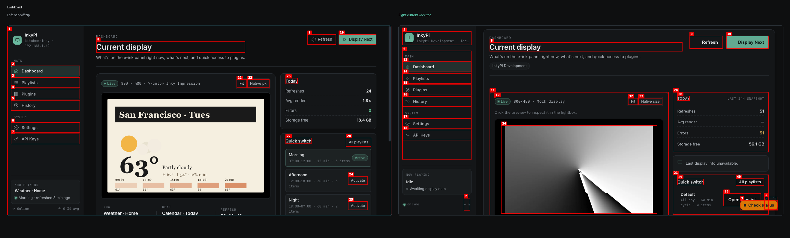
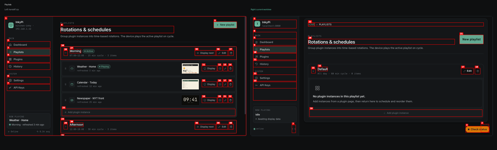
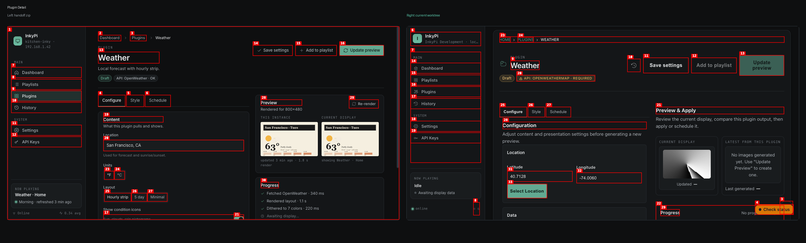
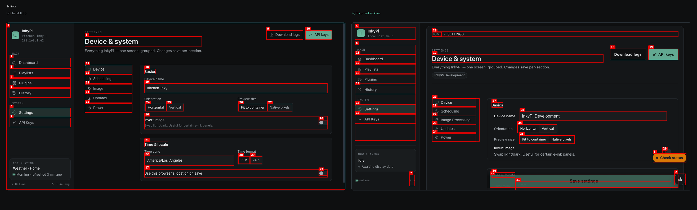
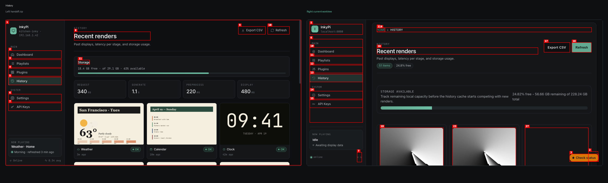
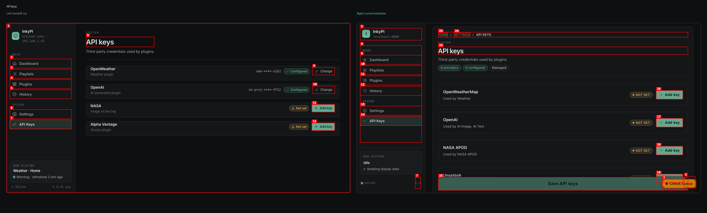
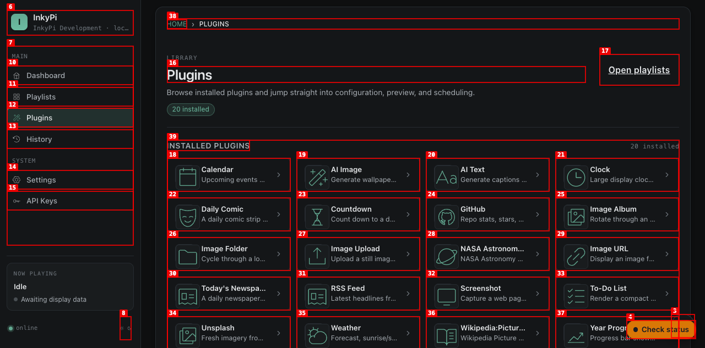

# InkyPi Handoff Side-by-Side

Captured on April 20, 2026 from:

- Handoff reference: `/tmp/inkypi_handoff_compare/update-to-inkypi/project`
- Current worktree: `claude/infallible-montalcini-c71168`
- Live app: `http://localhost:8080`

This comparison is visual first. Some differences are state-driven rather than layout-driven:

- The current dashboard capture is idle, so its sidebar `NOW PLAYING` card and hero content are less populated than the handoff.
- The current playlist capture has an empty `Default` playlist, while the handoff uses populated example rotations.
- The current API keys capture has no configured keys, while the handoff shows a mixed configured/unconfigured state.

## Summary

| Page | Match | Verdict |
| --- | --- | --- |
| Dashboard | Medium | The structure is close now, but the current idle state and a few operational extras still keep it from reading like the handoff at a glance. |
| Playlists | Medium | The card shell is much closer, but the empty local data means the key handoff pattern of populated rotation rows is still not proven in the live capture. |
| Plugin detail | Low-Medium | This is still the biggest visual drift. The current page keeps the same broad ideas but not the same composition. |
| Settings | Medium-High | One of the closer matches. The overall page grammar is right, with some extra product chrome still visible. |
| History | Medium | Top-level structure is aligned, but the current page is more operational and denser than the handoff. |
| API keys | Medium-High | The row pattern is now close, but the current page still carries more product framing and a sticky save affordance. |
| Plugins library | N/A | The current app has a dedicated `/plugins` page; the handoff does not have a true one-to-one equivalent. |

## Dashboard

What matches well:

- The page header now uses the same basic hierarchy: eyebrow, large title, short description, grouped secondary/primary actions.
- The main hero still follows the handoff split: preview on the left, KPI and quick-switch cards on the right.
- The sidebar footer is back to a real `NOW PLAYING` card instead of a generic status stub.

What still drifts:

- The current capture is idle, so the handoff's populated `Weather · Home` now-playing card and the richer hero-strip content are not visually matched.
- The current dashboard still shows an extra compact empty-state notice in the aside that the handoff does not need.
- The shell identity line is still environment-driven (`InkyPi Development`, localhost) rather than the cleaner handoff host/device sample.

Bottom line:

- The dashboard layout is materially closer than before, but the current state and a little extra operational chrome still keep it from feeling like a near-copy.

## Playlists

What matches well:

- The page title, action placement, and the overall rotation-card shell are now in the right family.
- The header row now uses the handoff-style left toggle, title block, and compact right actions.
- The dashed `Add plugin instance` row is back in roughly the right position and tone.

What still drifts:

- The current capture is an empty `Default` playlist, so the handoff's defining pattern of populated instance rows, previews, and per-item actions is not visually exercised here.
- The live page still carries breadcrumbs and status affordances that the handoff omits.
- The handoff shows multiple rotations with one expanded; the current state only shows one empty card, so rhythm and vertical pacing still feel different.

Bottom line:

- The structure is much better, but this page still needs a populated live-state check before we can call it truly aligned.

## Plugin Detail

What matches well:

- The page still uses the same broad idea: header actions across the top, left-side tabs, and a right-side preview/progress column.
- The `Configure / Style / Schedule` tab model is present.

What still drifts:

- The handoff's left column is calmer and more editorial. The current page still reads as a denser operational form.
- The handoff has a compact dedicated API-key card in the content column; the current page surfaces API-key state much more aggressively in the header.
- The right column composition differs noticeably. The handoff preview card is a tighter two-preview compare card; the current `Preview & Apply` block has a different information hierarchy.
- The header action cluster and chip treatment still feel heavier than the handoff.

Bottom line:

- This remains the biggest remaining handoff miss. It shares concepts with the prototype, but not the same visual composition.

## Settings

What matches well:

- The overall page grammar is close: page header, left navigation rail, grouped cards for `Basics` and `Time & locale`, and top-right actions.
- The section labels and two-card arrangement are in the same family as the handoff.

What still drifts:

- The current page still includes extra product chrome: breadcrumb, device chip, sticky save area, and floating health/log affordances.
- The current nav labels are a little more product-specific than the handoff (`Image Processing` vs `Image`).
- The current save control lives as a persistent bottom action bar, which is not part of the handoff composition.

Bottom line:

- This is one of the closest pages overall, but it still looks like the production app wearing a handoff-inspired shell rather than the handoff itself.

## History

What matches well:

- The header, `Export CSV` and `Refresh` actions, and the storage-first top block all align with the handoff.
- The page still reads as a render-history surface rather than a generic admin list.

What still drifts:

- The handoff uses a very explicit 4-up metrics strip near the top; the current page has evolved into a denser operational history view with more metadata and action controls.
- The current gallery cards are heavier and more utility-oriented.
- Pagination, destructive actions, and larger operational affordances move the page away from the handoff's cleaner presentation layer.

Bottom line:

- The top of the page is directionally close, but the body of the page has intentionally diverged into a more operational tool.

## API Keys

What matches well:

- The managed provider list now uses the same flattened row pattern as the handoff.
- Provider name on the left, status chip near the right, and the `Add key`/`Change` CTA placement are now much closer.

What still drifts:

- The current page shows six providers instead of the handoff's four examples.
- The current capture is entirely unconfigured, so it cannot visually prove the mixed configured/unconfigured rhythm shown by the handoff.
- Breadcrumbs, summary chips, and the sticky save bar are all production additions not present in the handoff.

Bottom line:

- This page is much closer now. The main remaining drift is product framing and current data state, not the core row pattern.

## Plugins Library

Notes:

- The current app has a dedicated `/plugins` library page.
- The handoff does not have a true standalone plugins-library screen. Its closest equivalent is the dashboard plugin section.
- Because of that, this page is best judged as an intentional IA extension rather than a direct parity target.

Current assessment:

- The tile language and dark shell are consistent with the handoff direction.
- This page is product-valid, but it should not be treated as a one-to-one mismatch against the zip.

## Highest-Value Remaining Gaps

1. The plugin detail page still needs a dedicated visual refactor if the goal is true handoff parity.
2. The dashboard should be rechecked with real now-playing data and at least one active playlist so the visual comparison is not dominated by idle-state emptiness.
3. The playlist page should be rechecked with a populated playlist to validate row density, thumbnail sizing, and action balance against the handoff.
4. If exact parity matters, settings and API keys still need a call on whether the production extras should be visually reduced or simply accepted as deliberate deviations.
